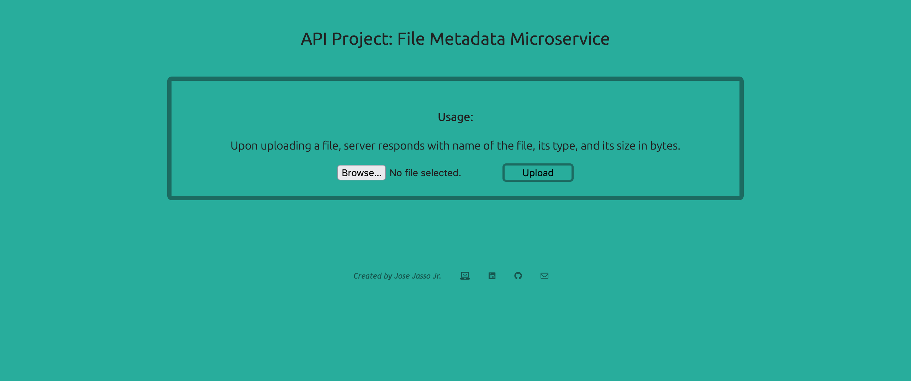

# Jose Jasso Jr. | File Metadata Microservice

A microservice designed to return metadata information of an uploaded file!

## Techs Used

[Node.js](https://nodejs.org/en/) and CSS

## Preview of Site

## Link to Site
Site can be found on [https://jasso-fcc-filemetadata.herokuapp.com/](https://jasso-fcc-filemetadata.herokuapp.com/) 

Deployed with [Heroku](https://heroku.com/)

